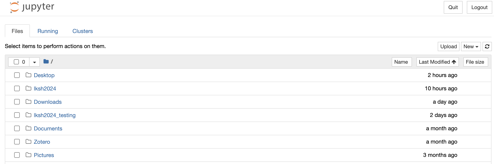

### Как открыть файл в `jupyter notebook`?

1. После установки Anaconda у вас должно появиться приложение `Anaconda Navigator`. Запустите его! (может запускаться довольно долго)
2. Выберите в меню `jupyter notebook`. Нажмите Launch
3. Должно открыться окно в браузере, похожее на это:

4. ☝️ Если вы установили Anaconda по стандартному пути вы окажетесь в C:\Users\\\*имя юзера\*\. Стоит скопировать рабочие материалы куда-то в эту директорию.
5. Перейдите в директорию с рабочими материалами:

6. Кликните на файл `.ipynb`

Теперь давайте разбираться со средой разработки. Мы с вами находимся в `jupyter notebook`. Это смесь кода и текста, которая позволяет писать код, запускать его и сразу видеть результат. Все это происходит в браузере. То, что вы сейчас читаете, это текст, который написан на языке разметки [markdown](https://github.com/adam-p/markdown-here/wiki/Markdown-Cheatsheet).